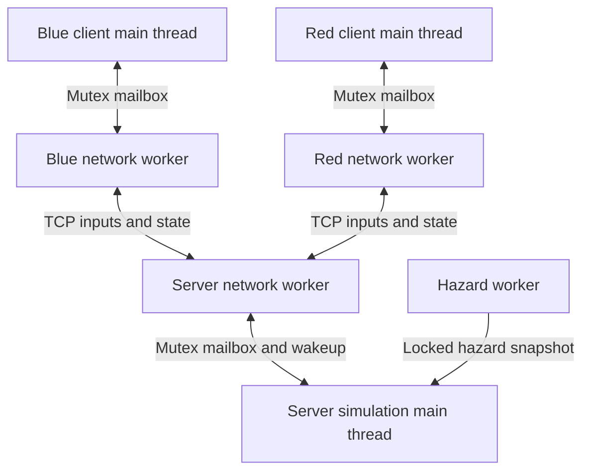

# Architecture

The host runs **two processes**: a server and a regular graphical client.
The second computer runs one client. Only the server changes the world.
The clients display authoritative player positions, switches, exit flags,
hazards, round number and win state. Every client receives a player assignment
in its snapshot; it cannot choose which player's input to overwrite.

## Files and ownership

| Component | Responsibility |
| --- | --- |
| `World` | Movement, wall/door collision, switch latching, hits, exit and win rules |
| `Rooms` | Shared map layouts used by client rendering and server collision |
| `NetworkServer` | Accept two clients, receive inputs and transmit latest world state |
| `NetworkClient` | Connect, heartbeat inputs, receive and publish snapshots |
| `Protocol` | Typed serialization and version/shape validation |
| `NetworkGame` | Main-thread events, drawing, status UI, generated sound cues |
| `HazardSystem` | Existing mutex-protected hazard simulation worker |
| `Game` | Local two-player mode |

There are three application-controlled server threads and two per network
client. SFML/platform audio or graphics drivers may create additional internal
threads. Rendering remains on the main thread, including on macOS.

The server updates movement at 60 fixed steps per second. Hazard positions come
from one locked snapshot per step; collisions and transmitted positions use that
same copy. The existing hazard thread continues its own time-based update even
in the lobby and after a win. A reset resets objectives/players, not hazard phase.

Each socket belongs to its network worker. No socket reads/writes occur on the
render thread. Mutexes guard the shared input and snapshot mailboxes; condition
variables wake workers on new data or shutdown, with short timed waits for
network polling. Worker shutdown uses an atomic flag and join. Initial client
connect has a three-second timeout, so closing during connect can take that long.

## Protocol and reliability

Clients send four movement bits plus a monotonically changing reset request
counter about every 16 ms. A reset counter survives mailbox overwrites, unlike a
one-frame boolean. Repeated packets with the same counter do not reset again.
The server derives normalized motion at its own fixed timestep, so diagonal
movement is not faster and clients cannot submit positions or frame durations.

Snapshots include protocol version, assigned player index, positions, two
hazards, switches, finished flags, readiness, win state, hit count and round.
Positions are signed 32-bit millipixels serialized through SFML Packet; no raw
C++ struct/padding or native-endian float bytes cross the network.

TCP sends may be partial. An unfinished packet is retained and retried without
modification until complete; then the newest available snapshot replaces older
unsent state. There is no unbounded outgoing snapshot queue. Receive work is
limited per loop. Input idle for 250 ms becomes neutral; five seconds without a
valid heartbeat disconnects a peer. Lost focus also sends neutral input.
Connection membership changes reset the round and clear a departed player's input.
The remaining player waits for a replacement. Extra clients are closed.

These limits prevent routine stalled peers from freezing gameplay, but this
small demo is designed for trusted LAN users rather than hostile clients.
